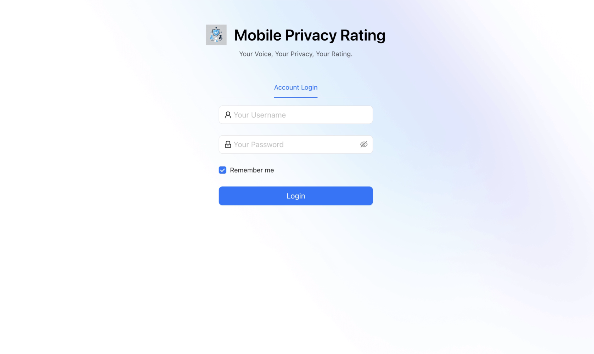
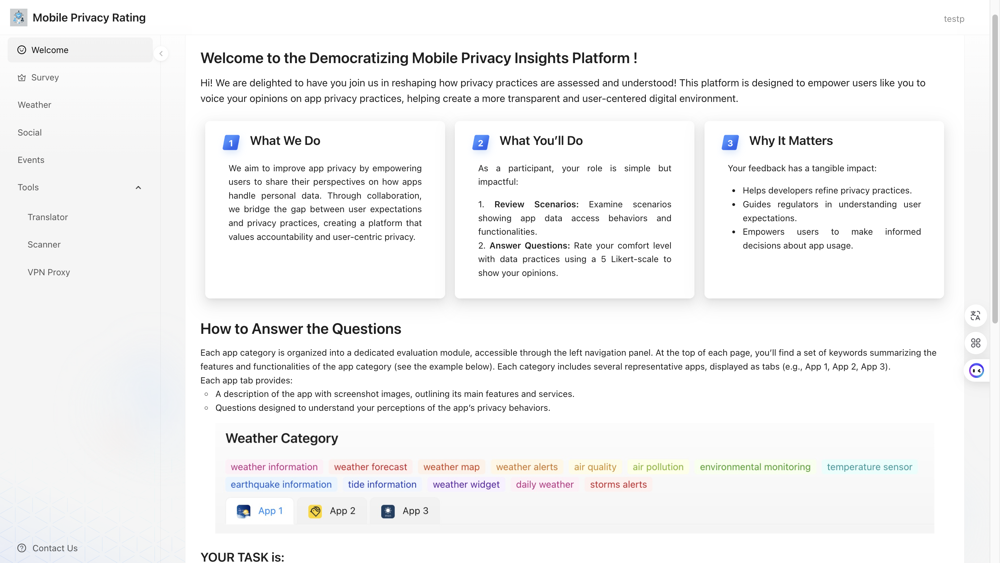
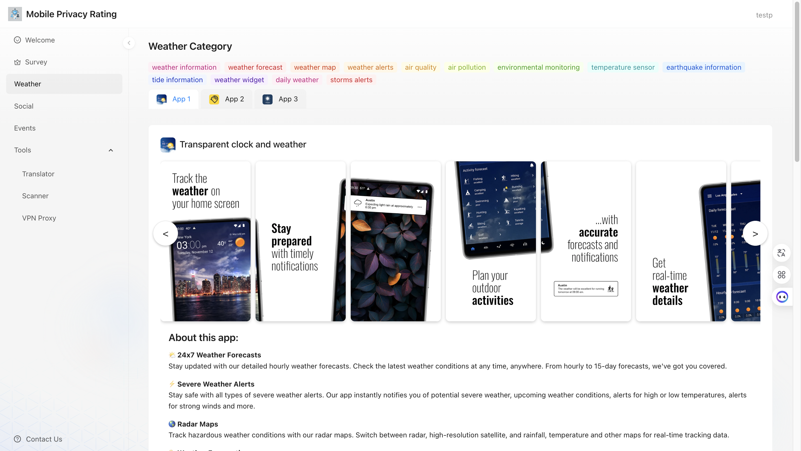
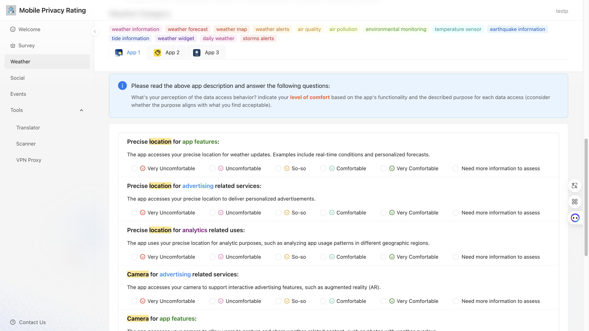

# DePRa

DePRa (Democratize Privacy Rating) is a web-based research platform designed to collect and analyze user privacy assessments regarding mobile apps. 
The system facilitates privacy research through interactive evaluation tasks.

## Live Demo

Experience the DePRa platform at: **http://privacyrating.cloud/**

The platform provides an intuitive user experience for privacy evaluation tasks:

### 1. Login Interface
Upon accessing the platform, users are presented with a simple login interface. You can enter any username and password to access the system. (If login is unsuccessful, try using a different username and attempt again.)

### 2. Welcome and Guidance
After logging in, users are greeted with a welcome page that provides clear instructions and guidance for conducting privacy evaluations.

### 3. Contextual Information
The platform presents detailed contextual information about apps and their data access practices, helping users make informed privacy assessments.

### 4. Rating Interface
Users can evaluate privacy practices using an intuitive rating interface with clear scales and contextual explanations.

## System Architecture

### Frontend (`frontend/`)
- **Framework**: React 18 with Ant Design Pro
- **Technology Stack**: TypeScript, Ant Design components, UmiJS
- **Key Features**:
  - User authentication and session management
  - Interactive privacy risk surveys
  - Multi-category app evaluation system (Weather, Social, Events, Tools)
  - Dynamic question lists with rating scales
  - Responsive design with internationalization support

### Backend (`backend/`)
- **Framework**: Flask with SQLAlchemy ORM
- **Key Components**:
  - User management with password hashing
  - Survey data collection and storage
  - Dynamic table creation for different app categories
  - RESTful API endpoints
  - Database migrations with Alembic

### Database Schema
- **Users**: Authentication and user management
- **Surveys**: Risk preference questionnaires with demographics
- **Contact**: User feedback and contact forms
- **Dynamic Tables**: Category-specific app evaluation responses

## Key Files
- `backend/app.py`: Main Flask application with API routes
- `backend/models.py`: Database models and dynamic table management
- `frontend/src/pages/PrivacyRiskSurvey.tsx`: Main survey interface
- `frontend/config/routes.ts`: Application routing configuration

## Setup and Development
- Frontend: Node.js with npm/yarn, supports hot reloading
- Backend: Python Flask with virtual environment support
- Database: MySQL with migration support